# 🐰 Usando filas com RabbitMQ e NodeJS

## Objetivo

Exemplo de uso de filas usando o protocolo AMQP e o RabbitMQ. Neste projeto será criado uma API Rest que irá receber uma chamada para inclusão de uma mensagem de log (exemplo mais típico).

Esta mensagem de log será enviada para um exchange que posteriormente será associado a filas do tipo `Direct` definindo uma `Routing Key` para cada uma delas.

Também terá o exemplo de um microserviço que será disparado pela API após sua chamada para fazer o papel de `Producer` enviando as mensagens via um _Channel_ para o _Exchange_.

Por fim, dois outros microserviços serão criados para fazerem as vezes do `Consumer` atuando em três filas distintas, fechando de ponta a ponta o conceito de uso de filas com o _RabbitMQ_ e construindo um bom exemplo, ainda que simples para você aprimorar seu aprendizado e conhecimento.

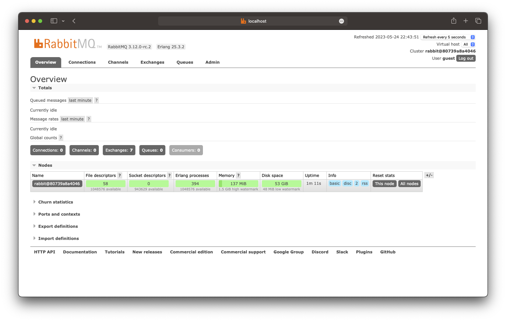

---

## Cenário

Uma aplicação fictícia rodando em vários clientes na modalidade on-premises, ou em um cloud privado, precisa notificar a uma central de controle todos os eventos de sucesso, alerta ou falhas catastróficas quando vão consumir serviços de API contratadas separadamente ao pacote principal da aplicação.

As chamadas com __sucesso__ devem ser encaminhadas ao time de _pós vendas_ para trabalhar o encantamento do cliente e também o time _financeiro_ que vai fazer a cobrança de uso dos serviços.

Já as mensagens de __alertas__ vão para uma fila específica que será acessada pelo time de _suporte 1o nível_ e por fim as mensagens de __falhas catastróficas__ para o time de desenvolvimento na fábrica de software atuar na sua correção.

Um modelo fictício mas com um desenho bem provável de encaixar com vários cenários potencialmente reais.

---

## Pré-requisitos

### Software

    NodeJS
    Docker
    Postman (ou similar)
    RabbitMQ via Docker
    VSCode (ou similar)

### Módulos JS

    amqplib
    express
    body-parser

### RabbitMQ

Você pode instalar o RabbitMQ localmente na sua estação de desenvolvimento, ou em algum servidor público ou privado.

Todavia vou encoraja-lo a usar uma imagem __Docker__ de forma a facilitar ainda mais a montagem do seu ambiente de desenvolvimento e testes. Mais detalhes sobre o Docker, você poderá encontrar no [Site Oficial](https://www.docker.com) do produto. Baixe a versão adequada para seu sistema operacional e posteriormente, selecione uma imagem do RabbitMQ.

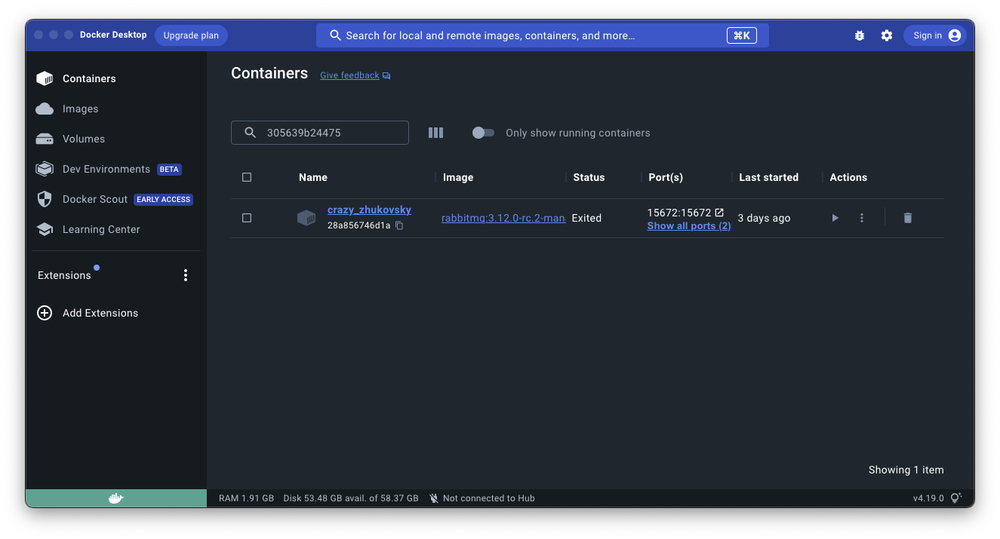

---

## Estrutura do projeto

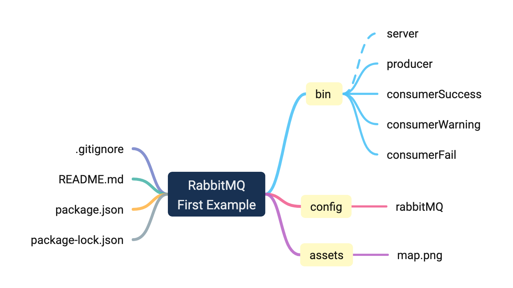

---

## Mensageria

Para este projeto iremos trabalhar com filas do tipo __Direct__, todas elas com _bind_ com as regras conforme a seguir.

### Filas:

    ### queue-sucess
    Routing Key - logType: success

    ### queue-support
    Routing Key - logType: warning

    ### queue-desenv
    Routing Key - logType: fail

### Mensagem enviada pelo Producer  

#### ✅ Success message

```json
{
    "date": "2023-05-20T23:20:00",
    "clientID": 763564785,
    "serviceID": "A-234V1",
    "logType": "success",
    "message": "File Download and save on GED with success."
}
```

#### 🚨 Warning message

```json
{
    "date": "2023-05-20T23:20:00",
    "clientID": 76387685,
    "serviceID": "A-872V1",
    "logType": "warning",
    "message": "Disk space at below 20 mb."
}
```

#### 💀 Fail message

```json
{
    "date": "2023-05-20T23:20:00",
    "clientID": 763564785,
    "serviceID": "B-667V3",
    "logType": "fail",
    "message": "Not permission to execute call to API."
}
```
__Importante:__ A routing key que é informada na chave _logType_ do jSon obrigatoriamente necessita estar em caixa baixa para que seja validada pelo binding no RabbitMQ. Pode ser uma boa idéia você implementar uma camada a mais de segurança para sempre deixar todo o conteúdo em caixa baixa usando `<string>._toLowerCase()` para isto.

---

## Configurando e iniciando o projeto

Após efetuar o clone ou copiar os arquivos para sua estação de trabalho, vá até o diretório onde estão os arquivos e digite o comando para baixar os módulos JS. Aqui estou levando em consideração que você já tem instalado o NodeJS, o NPM e o Docker com a imagem do RabbitMQ configurada e UP.

Na raiz do projeto digite

```bash
npm install
```

Após a instalação dos pacotes, vamos iniciar o servidor que vai receber o consumo da API pela aplicação `producer` que está no diretório _./bin_ aguardando ser iniciada.

Na raiz do projeto digite

```bash
npm run server
```

Se tudo transcorreu corretamente, o servidor está iniciado na porta 6001 como pode ser constatado na console do nodeJS. Se você precisar configurar outra porta, acesse o código fonte na pasta _./bin_ e modifique na instrução `app.listen()`.

Vamos iniciar também os microserviços de consumo das filas. Abra uma sessão separada de terminal para cada uma delas para que você possa acompanhar o consumo e a exibição na console.

Na raiz do projeto digite
```bash
npm run success  
```
```bash
npm run warning
```
```bash
npm run fail
```

Agora que já temos o barramento que vai receber as solicitações via API, vamos iniciar o `postman` ou a aplicação similar que você usa para chamar a API passando um mensagem aleatória.

Você pode enviar quantas mensagens quiser clicando no botão _Send_ mas deve alterar o `logType` para direcionar para a fila correta e trocar a descrição da mensagem para ver acoando na console, pois esta chave no _jSon_ é a nossa Routing Key. Acima você tem uma informação sobre as filas, confira lá.

```json
{
    "date": "2023-05-26T22:37:00",
    "clientID": 7635483,
    "serviceID": "L-A877V1",
    "logType": "success",
    "message": "Login success ..."
}
```

Enviando mensagem de Sucesso pelo _Postman_ 

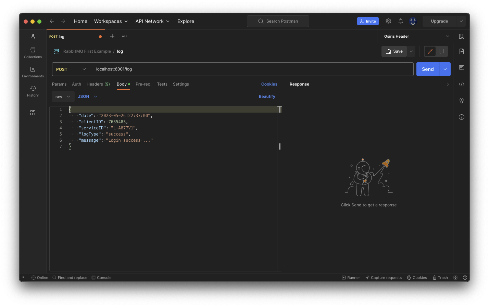

Ao enviar a mensagem para o barramento da API, ela será tratada e endereçada para o barramento do _RabbitMQ_ para o exchange padrão configurado na aplicação. A constatação do sucesso pode ser conferida na tela do Postman que recebeu http code 200 como resposta e na console de execução do server sendo ecoado na tela, conforme exemplo abaixo.

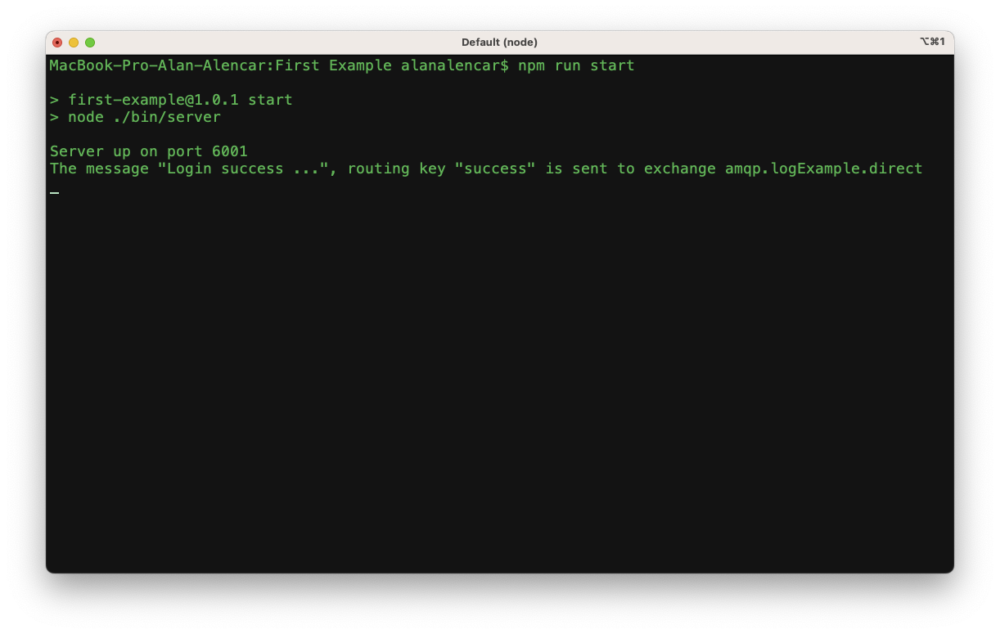

Em questões de segundos, o microserviço que monitora a fila com Routing Key _success_ vai consumi-la e simular um processamento simplesmente ecoando na tela o _json_ recebido. Aqui é onde você implementa a lógica que você precisa para seu negócio.

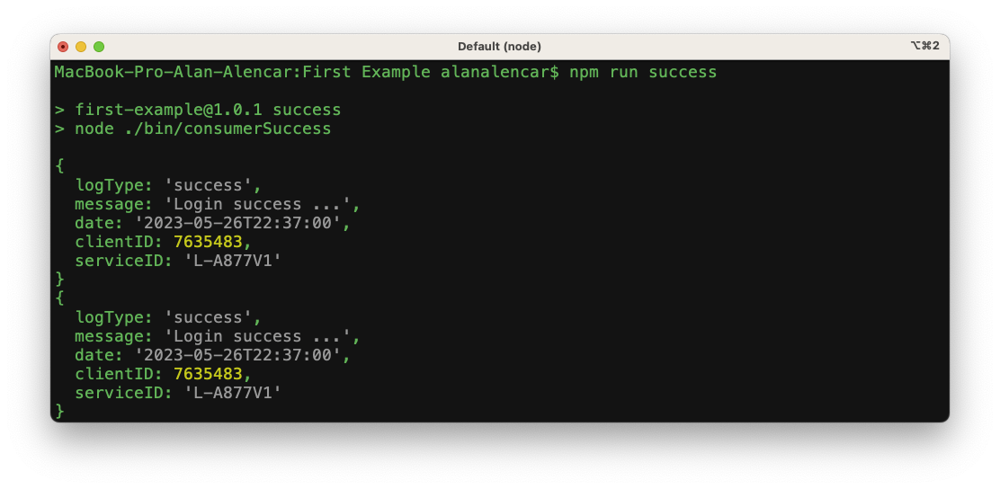

A seguir, telas mostrando a simulação das outras duas routing keys mapeadas no exemplo.

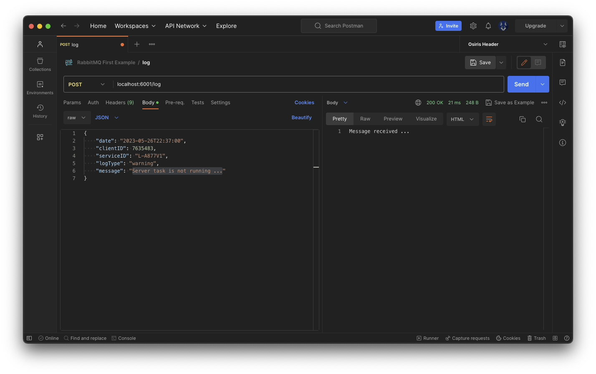

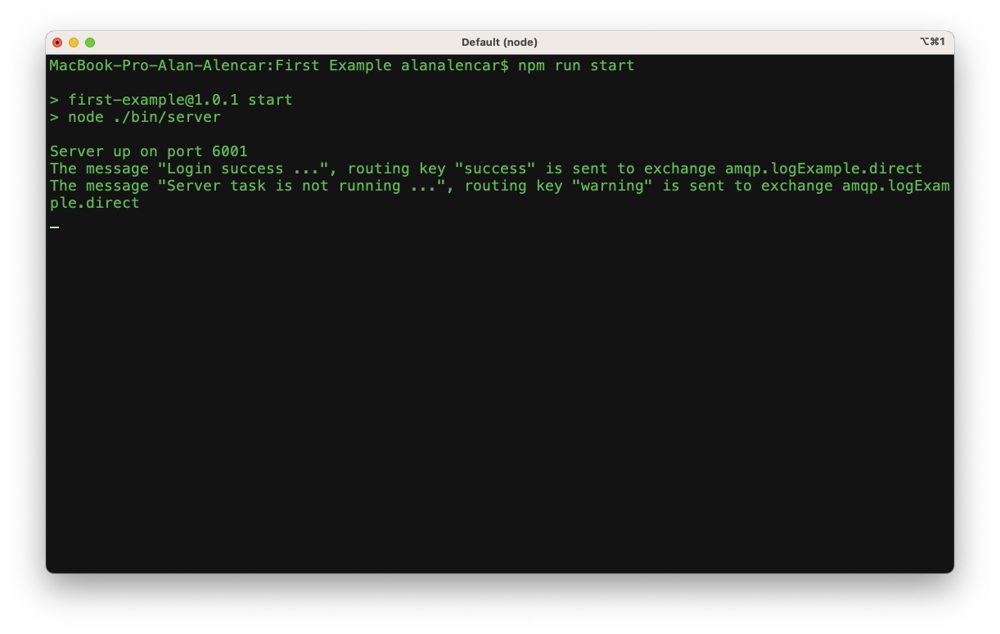

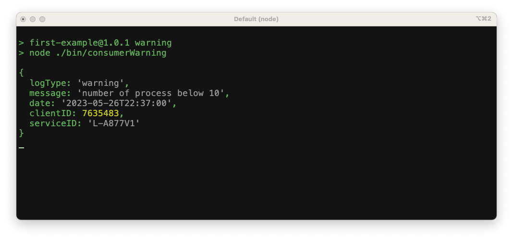

__Atenção:__ _As mensagens não são necessariamente as mesmas pois os prints foram sendo retirados durantes os testes da aplicação, mas são ações reais de execução._

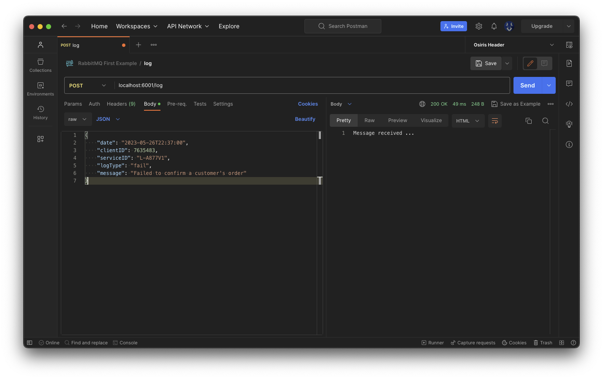


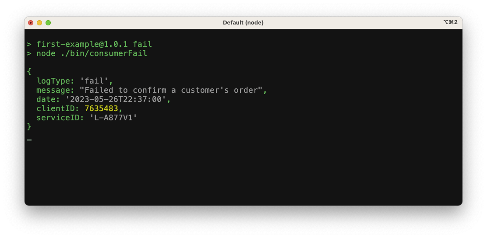

Teste quantas vezes quiser, e veja como é robusto esta arquitetura. Divirta-se.

---

## Principais falhas

Abaixo as principais falhas encontradas na execução deste repositório na sua configuração local:

>__1__: _Ao chamar a API /log não está sendo possível comunicar com o repositório do RabbitMQ do meu ambiente Docker._

Verifique se o mapeamento da porta local _5672_ está corretamente feito com a mesma porta no ambiente do Docker. Esta é uma falha bem comum e elas precisam estar neste formato.

>__2__: _Não estou conseguindo baixar uma imagem do RabbitMQ no meu Docker Desktop que funcione. Qual devo baixar?_

No desenvolvimento deste projeto foi utilizada a imagem `rabbitmq:3.12.0-rc.2-management-alpine` pesquisada no próprio Docker Desktop.

>__3__: _Como verificar se minha imagem Docker do RabbitMQ está rodando na minha máquina corretamente?_

Você pode verificar no _Docker Desktop_ a execução da imagem de maneira bem fácil e simples. Você deve encontrar no log alguma instrução parecida com a listada abaixo.

```shell
2023-05-21 11:00:44 2023-05-21 14:00:44.546170+00:00 [info] <0.588.0> Ready to start client connection listeners
2023-05-21 11:00:44 2023-05-21 14:00:44.551461+00:00 [info] <0.733.0> started TCP listener on [::]:5672
2023-05-21 11:00:45  completed with 4 plugins.
2023-05-21 11:00:45 2023-05-21 14:00:45.603323+00:00 [info] <0.588.0> Server startup complete; 4 plugins started.
2023-05-21 11:00:45 2023-05-21 14:00:45.603323+00:00 [info] <0.588.0>  * rabbitmq_prometheus
2023-05-21 11:00:45 2023-05-21 14:00:45.603323+00:00 [info] <0.588.0>  * rabbitmq_management
2023-05-21 11:00:45 2023-05-21 14:00:45.603323+00:00 [info] <0.588.0>  * rabbitmq_web_dispatch
2023-05-21 11:00:45 2023-05-21 14:00:45.603323+00:00 [info] <0.588.0>  * rabbitmq_management_agent
```
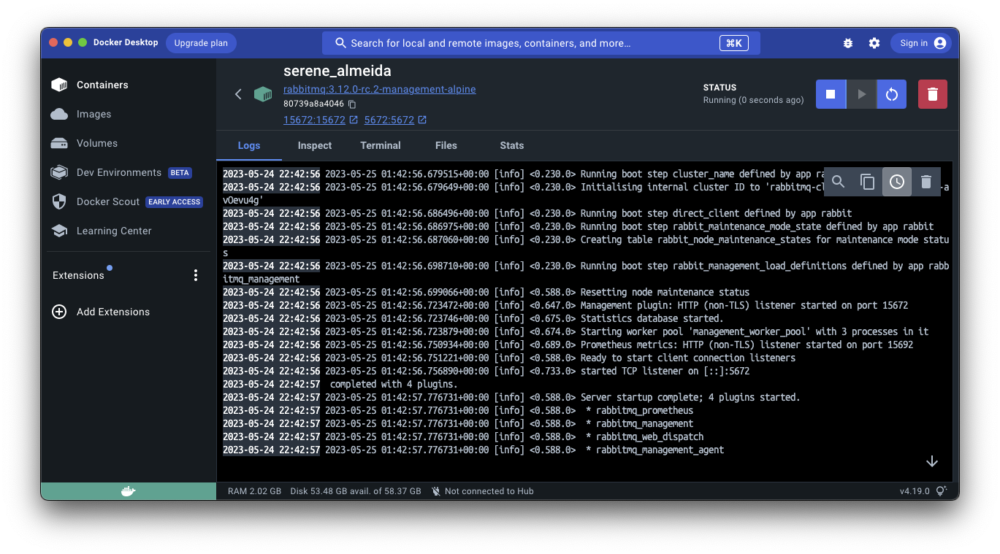

Uma outra forma é abrindo a console do RabbitMQ no seu navegador. Se for apresentado a tela de login, é sinal positivo que o ambiente está _up_ e vocë poderá consumir via protocolo _amqp_ normalmente. O usuário e senha padrão é `guest` e `guest`.

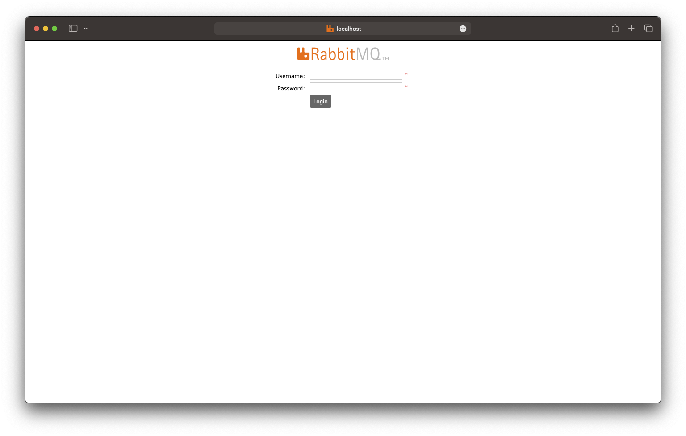

Conexão sendo registrada na console do RabbitMQ.

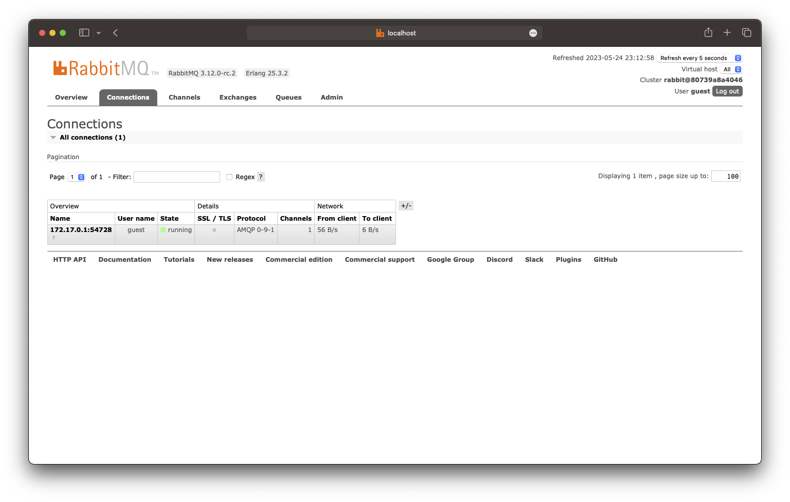

Detalhes da conexão no RabbitMQ.

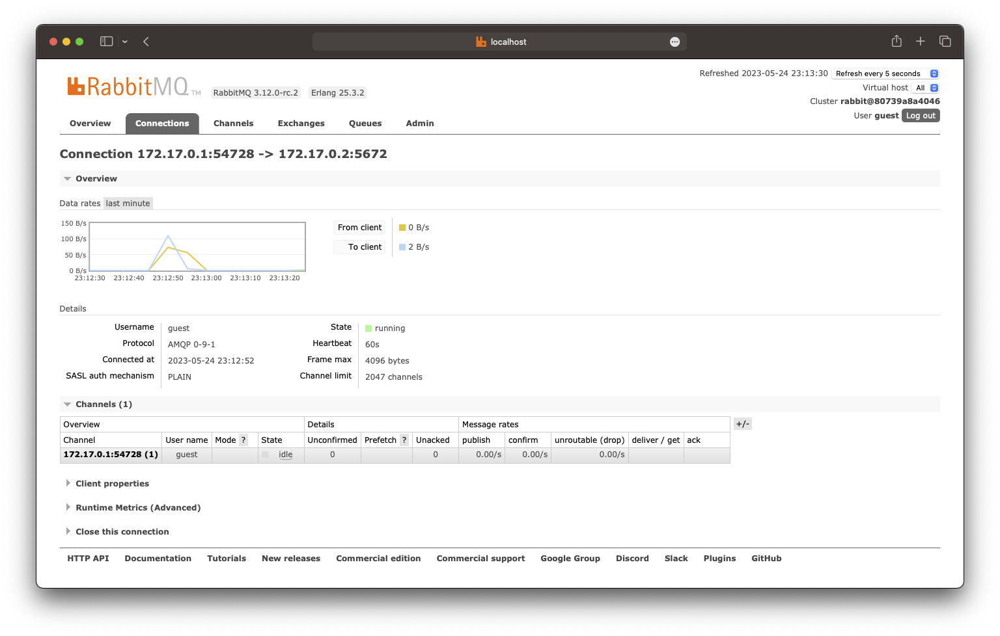

Visão dos canais (channels) sendo usado pelo microserviço.

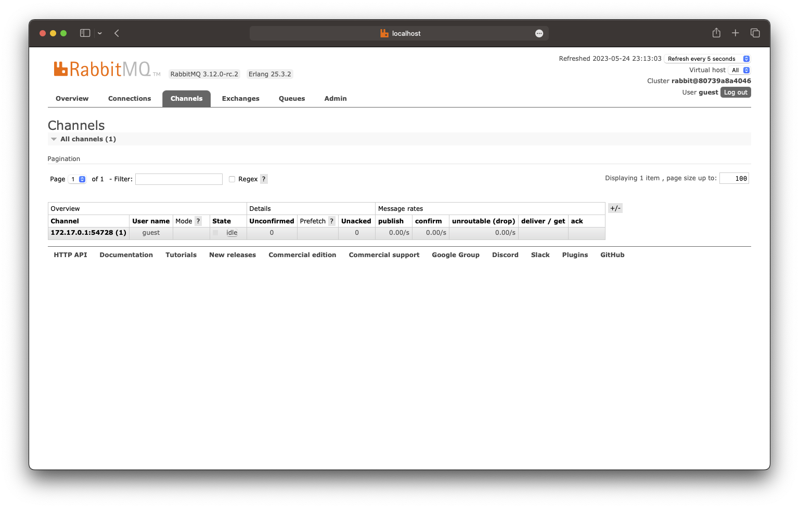

Visão dos canais (channels) sendo usado pelo microserviço agora com detalhes do consumo e das estatísticas.

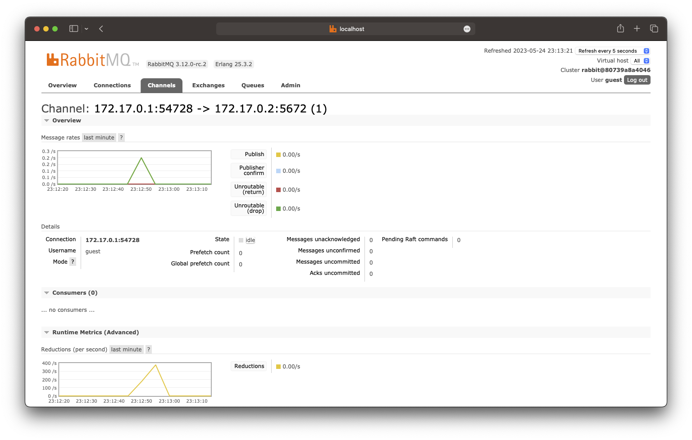

Exchange usado no exemplo sendo exibido no RabbitMQ.


Queue no RabbitMQ.

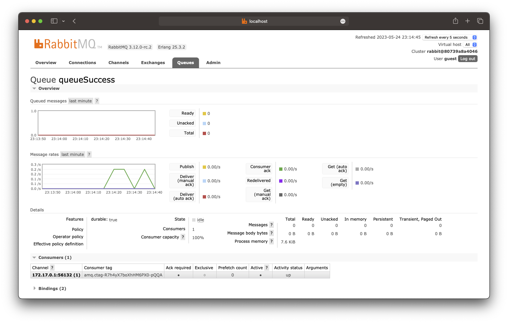

_Alan Alencar, 2023_
